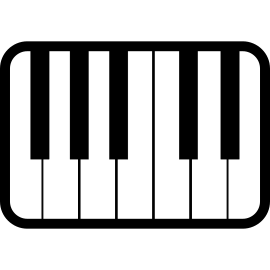

# openfx-midi


OpenFX plugin that communicates with MIDI controllers.

## Build and install *(for Linux/BSD)*

```
git clone https://github.com/rodlie/openfx-midi
cd openfx-midi
git submodule update -i
mkdir build && cd build
cmake -DCMAKE_INSTALL_PREFIX=/usr/OFX/Plugins ..
make
sudo make install
```

## Build for Windows *(on Linux/BSD/macOS)*

```
git clone https://github.com/rodlie/openfx-midi
cd openfx-midi
git submodule update -i
git clone https://github.com/mxe/mxe
cd mxe
make MXE_TARGETS='x86_64-w64-mingw32.static' cc cmake
cd ..
export PATH=`pwd`/mxe/usr/bin:$PATH
mkdir build && cd build
x86_64-w64-mingw32.static-cmake -DCMAKE_INSTALL_PREFIX=/ ..
make
x86_64-w64-mingw32.static-strip -s Midi.ofx
make DESTDIR=`pwd`/output install
mv output/Midi.ofx.bundle .
zip -9 -r Midi.ofx.bundle.zip Midi.ofx.bundle
```

## License

### openfx-midi

```
Copyright (C) 2019 Ole-André Rodlie <ole.andre.rodlie@gmail.com>

This program is free software; you can redistribute it and/or
modify it under the terms of the GNU Lesser General Public
License as published by the Free Software Foundation; either
version 2.1 of the License, or (at your option) any later version.

This program is distributed in the hope that it will be useful,
but WITHOUT ANY WARRANTY; without even the implied warranty of
MERCHANTABILITY or FITNESS FOR A PARTICULAR PURPOSE.  See the GNU
Lesser General Public License for more details.
```

### RtMidi

```
RtMidi: realtime MIDI i/o C++ classes
Copyright (c) 2003-2019 Gary P. Scavone

Permission is hereby granted, free of charge, to any person
obtaining a copy of this software and associated documentation files
(the "Software"), to deal in the Software without restriction,
including without limitation the rights to use, copy, modify, merge,
publish, distribute, sublicense, and/or sell copies of the Software,
and to permit persons to whom the Software is furnished to do so,
subject to the following conditions:

The above copyright notice and this permission notice shall be
included in all copies or substantial portions of the Software.

Any person wishing to distribute modifications to the Software is
asked to send the modifications to the original developer so that
they can be incorporated into the canonical version.  This is,
however, not a binding provision of this license.

THE SOFTWARE IS PROVIDED "AS IS", WITHOUT WARRANTY OF ANY KIND,
EXPRESS OR IMPLIED, INCLUDING BUT NOT LIMITED TO THE WARRANTIES OF
MERCHANTABILITY, FITNESS FOR A PARTICULAR PURPOSE AND NONINFRINGEMENT.
IN NO EVENT SHALL THE AUTHORS OR COPYRIGHT HOLDERS BE LIABLE FOR
ANY CLAIM, DAMAGES OR OTHER LIABILITY, WHETHER IN AN ACTION OF
CONTRACT, TORT OR OTHERWISE, ARISING FROM, OUT OF OR IN CONNECTION
WITH THE SOFTWARE OR THE USE OR OTHER DEALINGS IN THE SOFTWARE.
```

### OpenFX

```
Copyright (c) 2004-2007, The Open Effects Association Ltd. All rights reserved.

Redistribution and use in source and binary forms, with or without
modification, are permitted provided that the following conditions are met:

    * Redistributions of source code must retain the above copyright notice,
      this list of conditions and the following disclaimer.
    * Redistributions in binary form must reproduce the above copyright notice,
      this list of conditions and the following disclaimer in the documentation
      and/or other materials provided with the distribution.
    * Neither the name The Open Effects Association Ltd, nor the names of its 
      contributors may be used to endorse or promote products derived from this
      software without specific prior written permission.

THIS SOFTWARE IS PROVIDED BY THE COPYRIGHT HOLDERS AND CONTRIBUTORS "AS IS" AND
ANY EXPRESS OR IMPLIED WARRANTIES, INCLUDING, BUT NOT LIMITED TO, THE IMPLIED
WARRANTIES OF MERCHANTABILITY AND FITNESS FOR A PARTICULAR PURPOSE ARE
DISCLAIMED. IN NO EVENT SHALL THE COPYRIGHT OWNER OR CONTRIBUTORS BE LIABLE FOR
ANY DIRECT, INDIRECT, INCIDENTAL, SPECIAL, EXEMPLARY, OR CONSEQUENTIAL DAMAGES
(INCLUDING, BUT NOT LIMITED TO, PROCUREMENT OF SUBSTITUTE GOODS OR SERVICES;
LOSS OF USE, DATA, OR PROFITS; OR BUSINESS INTERRUPTION) HOWEVER CAUSED AND ON
ANY THEORY OF LIABILITY, WHETHER IN CONTRACT, STRICT LIABILITY, OR TORT
(INCLUDING NEGLIGENCE OR OTHERWISE) ARISING IN ANY WAY OUT OF THE USE OF THIS
SOFTWARE, EVEN IF ADVISED OF THE POSSIBILITY OF SUCH DAMAGE.

The Open Effects Association Ltd
1 Wardour St
London W1D 6PA
England
```
